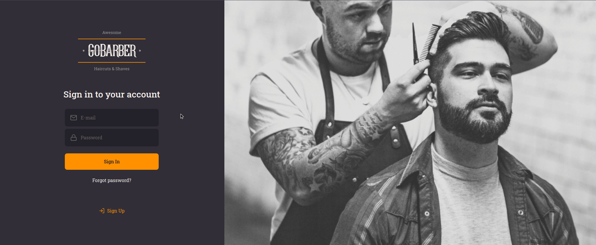
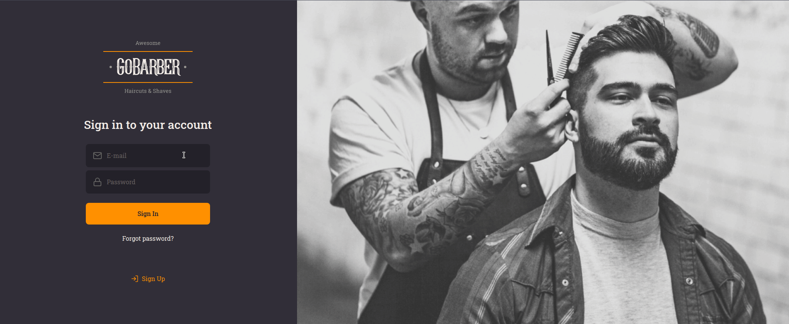

<h1 align="center">
  
</h1>

<h3 align="center">
  Phoenix version of GoBarber project
</h3>

</br>

<p align="center">As a provider</p>
<p align="center">
  
</p>

</br>

<p align="center">As a customer</p>
<p align="center">
  
</p>

## ✂️ About the project

GoBarber is a project for scheduling services, it was originally made with NodeJs and ReactJs in [Rocketseat's](https://rocketseat.com.br/) GoStack course

## 🚀 Technologies

- [Elixir](https://elixir-lang.org/)
- [Phoenix](https://phoenixframework.org/)
- [Phoenix LiveView](https://github.com/phoenixframework/phoenix_live_view)

## 💻 Getting started

### Requirements

- Erlang/Elixir
- Mix

### Clone the project and access the folder

```bash
$ git clone https://github.com/joaopsramos/gobarber-phoenix && cd gobarber-web
```
### Starting the app:

  * Install dependencies with `mix deps.get`
  * Create and migrate your database with `mix ecto.setup`
  * Install Node.js dependencies with `npm install` inside the `assets` directory
  * Start Phoenix endpoint with `mix phx.server`

Now you can visit [`localhost:4000`](http://localhost:4000) from your browser.

---

<p align="center">
  Made with 🧡 by <a href="https://www.linkedin.com/in/joaopsramos/">João Ramos</a>
</p>
